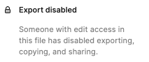

# PetSecur demo opdracht

Voor degene die het gaat checken, loop door alle stappen heen in de setup en als het goed is heb je een werkende installatie aan het einde met een imported database en een actief thema.

[Click here for install steps](SETUP.md).

## Inhoud
- [Intro](#intro)
- [Boilerplate](#boilerplate)
- [Grunt](#grunt)
- [Git](#git)
- [Assets](#assets)
- [Break out BG](#breakoutbg)
- [Inloggen](#login)

## Intro

Ik heb een 'interpretatie' gemaakt van het design, want aangezien de assets niet beschikbaar waren, was het roeien met de riemen die ik had.

Dit is beschikbaar op https://petsecur.aseda.nl. 

Zonder de benodigde assets vind ik het redelijk gelukt. Alle data is aanwezig alleen de decoratieve elementen ontbreken wat het design de 'look en feel' geeft.

### Extras

- De pagina is grotendeels responsive (albeit far form perfect). Het werd niet uitdrukkelijk genoemd, maar dit is altijd een vereiste imo. 
- Er zit een minimaal mobile fold out menu in.
- Er zitten ook 2 andere blocks in; content en contact. Content is een wysiwyg met header optie. Contact heeft wat meer 'opties'. 
- Ik heb 1 image toegevoegd aan het 'block columns' om de mogelijkheid weer te geven.

### Boilerplate
Zoals jullie het eigen framework Lyfter gebouwd hebben, zo heb ik ook een eigen 'jumping off' point gebouwd, mijn boilerplate noem ik dat en die heb ik bijgehouden door de jaren heen.

Deze repo is een uitgeklede variant daarvan. Ik had al iets opgezet voor ik de opdracht kreeg, wat gedaan was op basis daarvan en daarmee ben ik (in overleg met Carmen en Markus) verder gegaan.

Dit is een volledig custom theme met alles gerenderd in Twig en de bekende ACF blocks.

### BELANGRIJK
Ik heb ACF niet included want die installeer ik via composer en ik ga niet mijn key of een paid plugin includen in een public repo. Dus om dit te kunnen gebruiken, moet er even een ACF Pro installed worden in `/app/plugins`.

Het hele theme runt niet als ACF niet actief is dus dit is echt een noodzaak, maar daarvoor krijg je vanzelf een melding.

### Grunt
CSS wordt compiled door Grunt. Ja, I know niet de meest moderne manier. Webpack of Gulp heb ik ook gebruikt. In dit project zit nog steeds Grunt in (legacy). Moet ik nog steeds een keer vervangen, maar het werkt nog en is dus geen immediate prio.

### Git
Er zit niet de (git) historie in die je normaal bij een project zou hebben. Ik was (voor ik de opdracht kreeg) al bezig met 'iets' in een eigen repo en daarin zit behoorlijk wat code in die ik niet in een openbare repository wil delen.

Ik heb veel eruit gestript en daarom toen alles er zo goed als uit was, alles overgezet naar een nieuwe repo. Er is dus weinig historie en niet veel commit messages e.d. Ik vond het tbh ook een beetje vreemd dat commit messages genoemd werden als 'punt van aandacht'. Het resultaat van mijn werk moet voor zich spreken, niet een notitie als ik iets opsla.

### Assets

De assets waren niet beschikbaar in Figma. Ik weet niet of dit nu wel of niet expres was, maar als dit wel de bedoeling was, dan vind ik dit niet echt een goede, representatieve opdracht.

In al mijn jaren dat ik dingen heb gebouwd, heb ik nog nooit moeten bouwen op basis van een Figma design waarbij ik **geen** toegang heb tot de assets dus ik hoef nooit te improviseren. Een designer wil graag dat zijn/haar werk goed wordt vertaald en dus is het niet logisch om geen access te krijgen tot de assets.

Dat is wat een developer doet. Die bouwt iets op aanwijzen van een designer of 'wensen'. Het is niet zo dat men zegt, ik wil graag dat je dit nabouwt, maar zie maar hoe je dat doet.

Nu moest ik dus maar een beetje improviseren zonder de correcte assets. Ik heb wel een soortgelijke iphone image gedownload om te gebruiken maar dit is natuurlijk niet optimaal.

Zonder de achtergronden en accenten e.d. is het moeilijk om iets goed te laten lijken.

Ja er is wel iets mogelijk maar die accenten e.d. maar dat zijn voornamelijk grafische elementen en die worden dan aangeleverd. Dat realiseren met puur css kan een dedicated front-end developer maybe, maar ik niet.

### Break out BG
Ik kwam er net (pas) achter dat er 2 afwijkende blokjes onderaan staan qua background. Toen ik de opdracht keek scrollde ik er door heen en mij was toen niet opgevallen dat die 2 afweken.

Toen ik daarna het document steeds open had als reference, had ik dit voor de bovenste elementen. Ik keek niet onderin omdat dit in mijn herinnering hetzelfde was als de bovenste 2.

Dus ja, toegegeven, I dropped the ball a bit there. Normaal gesproken gaat er ook iets meer tijd over een opdracht en wordt die normaal gesproken besproken voor dat er wordt aangevangen (althans zo is mijn ervaring) en dan worden gotchas, zoals een afwijkende/break out background, daar besproken.

Nu heb ik deze dus gemist, maar die zou ik oplossen met een extra div met een position absolute, daarbij spelende met marges. Niet echt een onoverkomelijk iets.

### Inloggen

Je kan inloggen op https://petsecur.aseda.nl/cms/wp-admin.

De login is `Support`. Het wachtwoord hebben jullie als het goed is via email gehad.
